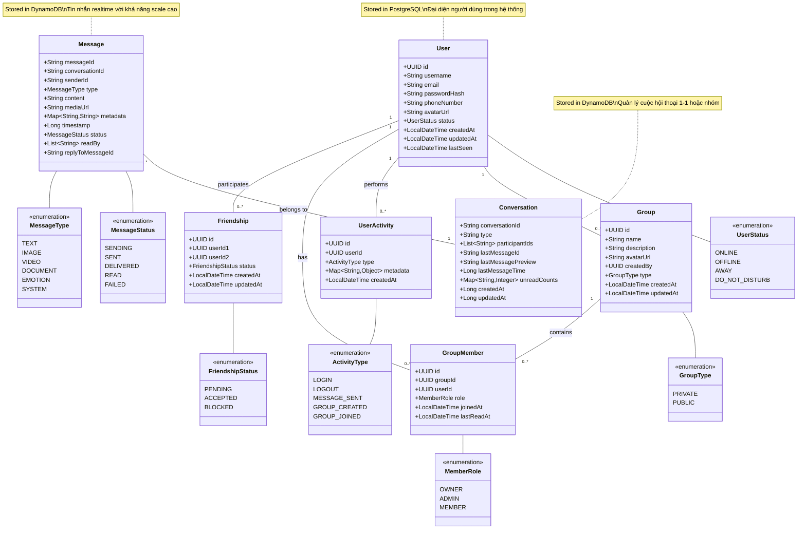
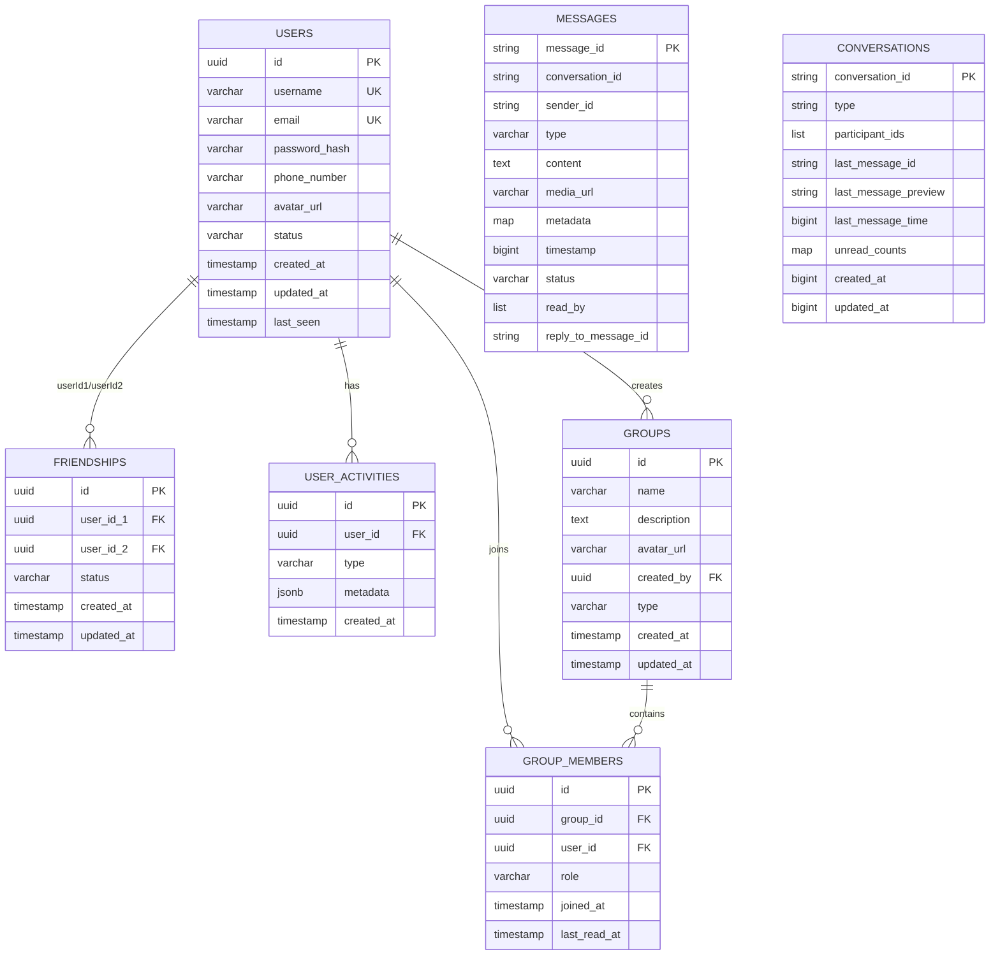

# Class Diagram - Zola Platform

## Mô tả hệ thống

Hệ thống Zola Platform là một ứng dụng nhắn tin tương tự Zalo, bao gồm:
- **PostgreSQL**: Lưu trữ thông tin người dùng, nhóm, quan hệ bạn bè
- **DynamoDB**: Lưu trữ tin nhắn và cuộc hội thoại (NoSQL cho hiệu năng cao)
- **Redis**: Cache và xử lý realtime

## Class Diagram

## Entity Relationship Diagram (Chi tiết)

## Giải thích các mối quan hệ

### 1. User - Friendship (Many-to-Many through Friendship)
- Một người dùng có thể có nhiều bạn bè
- Mỗi quan hệ bạn bè được lưu qua bảng `friendships` với 2 user_id
- Status: PENDING, ACCEPTED, BLOCKED

### 2. User - Group (One-to-Many)
- Một người dùng có thể tạo nhiều nhóm (createdBy)
- Một nhóm có một người tạo

### 3. User - GroupMember - Group (Many-to-Many)
- Một người dùng có thể tham gia nhiều nhóm
- Một nhóm có thể có nhiều thành viên
- Qua bảng trung gian `group_members` với role: OWNER, ADMIN, MEMBER

### 4. User - UserActivity (One-to-Many)
- Một người dùng có thể có nhiều hoạt động
- Lưu lại lịch sử: LOGIN, LOGOUT, MESSAGE_SENT, etc.

### 5. Conversation - Message (One-to-Many trong DynamoDB)
- Một cuộc hội thoại chứa nhiều tin nhắn
- Lưu trong DynamoDB để scale tốt
- Conversation có thể là DIRECT (1-1) hoặc GROUP

## Kiến trúc dữ liệu

### PostgreSQL Tables:
- `users`: Thông tin người dùng
- `friendships`: Quan hệ bạn bè
- `groups`: Thông tin nhóm
- `group_members`: Thành viên nhóm
- `user_activities`: Lịch sử hoạt động

### DynamoDB Tables:
- `Messages`: Tin nhắn (với GSI cho conversation và sender)
- `Conversations`: Cuộc hội thoại và metadata

### Redis:
- Cache user status
- Real-time presence
- Session management
