# Class Diagram - Zola Platform

## Overview

This document outlines the complete class structure for the Zola Platform. The application follows Domain-Driven Design (DDD) principles with clear separation of concerns across layers.

**Package Structure**: `com.zola`

**Architecture Pattern**: Layered Architecture (Presentation → Application → Domain → Infrastructure)

---

## Package Structure

```
com.zola
├── config/                   # Configuration classes
├── controller/               # REST API controllers (Presentation Layer)
├── domain/                   # Business logic and entities (Domain Layer)
│   ├── common/               # Shared domain components
│   │   └── enums/            # Enums (UserStatus, UserRole, etc.)
│   ├── user/                 # User domain
│   │   ├── entity/           # User entities
│   │   ├── dto/              # User DTOs
│   │   ├── service/          # User services
│   │   └── repository/       # User repositories
│   ├── group/                # Group domain
│   │   ├── entity/           # Group entities
│   │   ├── dto/              # Group DTOs
│   │   ├── service/          # Group services
│   │   └── repository/       # Group repositories
│   ├── message/              # Message domain
│   ├── statistics/           # Statistics domain
│   └── chatbot/              # Chatbot domain
├── security/                 # Security components (JWT, filters)
├── exception/                # Global exception handling
└── websocket/                # WebSocket configuration and handlers
```

---

## Domain Layer

### User Domain (`com.zola.domain.user`)

#### Entity: User

**Path**: `com.zola.domain.user.entity.User`

**Table**: `users`

```java
@Entity
@Table(name = "users")
public class User {
    // Core Identity
    @Id
    @GeneratedValue(strategy = GenerationType.UUID)
    private UUID id;

    @Column(unique = true, nullable = false, length = 50)
    private String username;

    @Column(unique = true, nullable = false, length = 100)
    private String email;

    @Column(name = "password_hash", nullable = false)
    private String passwordHash;

    // Profile Information
    @Column(name = "phone_number", length = 20)
    private String phoneNumber;

    @Column(name = "avatar_url", length = 500)
    private String avatarUrl;

    // Status & Role
    @Enumerated(EnumType.STRING)
    @Column(length = 20)
    private UserStatus status = UserStatus.OFFLINE;

    @Enumerated(EnumType.STRING)
    @Column(length = 20)
    private UserRole role = UserRole.USER;

    // Timestamps
    @CreationTimestamp
    @Column(name = "created_at", nullable = false, updatable = false)
    private LocalDateTime createdAt;

    @UpdateTimestamp
    @Column(name = "updated_at")
    private LocalDateTime updatedAt;

    @Column(name = "last_seen")
    private LocalDateTime lastSeen;

    // Authentication Enhancement Fields
    @Column(name = "email_verified")
    private Boolean emailVerified = false;

    @Column(name = "verification_token", length = 500)
    private String verificationToken;

    @Column(name = "verification_token_expiry")
    private LocalDateTime verificationTokenExpiry;

    @Column(name = "reset_token", length = 500)
    private String resetToken;

    @Column(name = "reset_token_expiry")
    private LocalDateTime resetTokenExpiry;

    @Column(name = "refresh_token", length = 500)
    private String refreshToken;

    @Column(name = "refresh_token_expiry")
    private LocalDateTime refreshTokenExpiry;

    @Column(name = "login_attempts")
    private Integer loginAttempts = 0;

    @Column(name = "locked_until")
    private LocalDateTime lockedUntil;

    // Methods
    public boolean isAccountLocked();
    public void incrementLoginAttempts();
}
```

**Enums Used**:

- `UserStatus`: ONLINE, OFFLINE, AWAY, DO_NOT_DISTURB
- `UserRole`: USER, ADMIN

---

#### Entity: Friendship

**Path**: `com.zola.domain.user.entity.Friendship`

**Table**: `friendships`

```java
@Entity
@Table(name = "friendships")
public class Friendship {
    @Id
    @GeneratedValue(strategy = GenerationType.UUID)
    private UUID id;

    @Column(name = "user_id_1", nullable = false)
    private UUID userId1;

    @Column(name = "user_id_2", nullable = false)
    private UUID userId2;

    @Enumerated(EnumType.STRING)
    @Column(length = 20)
    private FriendshipStatus status = FriendshipStatus.PENDING;

    @CreationTimestamp
    @Column(name = "created_at", nullable = false, updatable = false)
    private LocalDateTime createdAt;

    @UpdateTimestamp
    @Column(name = "updated_at")
    private LocalDateTime updatedAt;
}
```

**Enum**: `FriendshipStatus` - PENDING, ACCEPTED, BLOCKED

---

#### Entity: UserActivity

**Path**: `com.zola.domain.user.entity.UserActivity`

**Table**: `user_activities`

```java
@Entity
@Table(name = "user_activities")
public class UserActivity {
    @Id
    @GeneratedValue(strategy = GenerationType.UUID)
    private UUID id;

    @Column(name = "user_id", nullable = false)
    private UUID userId;

    @Enumerated(EnumType.STRING)
    @Column(nullable = false, length = 50)
    private ActivityType type;

    @Type(JsonBinaryType.class)
    @Column(columnDefinition = "jsonb")
    private Map<String, Object> metadata;

    @CreationTimestamp
    @Column(name = "created_at", nullable = false, updatable = false)
    private LocalDateTime createdAt;
}
```

**Enum**: `ActivityType` - LOGIN, LOGOUT, MESSAGE_SENT, GROUP_CREATED, GROUP_JOINED

---

### Group Domain (`com.zola.domain.group`)

#### Entity: Group

**Path**: `com.zola.domain.group.entity.Group`

**Table**: `groups`

```java
@Entity
@Table(name = "groups")
public class Group {
    @Id
    @GeneratedValue(strategy = GenerationType.UUID)
    private UUID id;

    @Column(nullable = false, length = 100)
    private String name;

    @Column(columnDefinition = "TEXT")
    private String description;

    @Column(name = "avatar_url", length = 500)
    private String avatarUrl;

    @Column(name = "created_by", nullable = false)
    private UUID createdBy;

    @Enumerated(EnumType.STRING)
    @Column(length = 20)
    private GroupType type = GroupType.PRIVATE;

    @CreationTimestamp
    @Column(name = "created_at", nullable = false, updatable = false)
    private LocalDateTime createdAt;

    @UpdateTimestamp
    @Column(name = "updated_at")
    private LocalDateTime updatedAt;
}
```

**Enum**: `GroupType` - PRIVATE, PUBLIC

---

#### Entity: GroupMember

**Path**: `com.zola.domain.group.entity.GroupMember`

**Table**: `group_members`

```java
@Entity
@Table(name = "group_members")
public class GroupMember {
    @Id
    @GeneratedValue(strategy = GenerationType.UUID)
    private UUID id;

    @Column(name = "group_id", nullable = false)
    private UUID groupId;

    @Column(name = "user_id", nullable = false)
    private UUID userId;

    @Enumerated(EnumType.STRING)
    @Column(length = 20)
    private MemberRole role = MemberRole.MEMBER;

    @CreationTimestamp
    @Column(name = "joined_at", nullable = false, updatable = false)
    private LocalDateTime joinedAt;

    @Column(name = "last_read_at")
    private LocalDateTime lastReadAt;
}
```

**Enum**: `MemberRole` - OWNER, ADMIN, MEMBER

---

## Data Transfer Objects (DTOs)

### Authentication DTOs (`com.zola.domain.user.dto`)

#### RegisterRequest

```java
public class RegisterRequest {
    @NotBlank(message = "Username is required")
    @Size(min = 3, max = 50, message = "Username must be 3-50 characters")
    private String username;

    @NotBlank(message = "Email is required")
    @Email(message = "Invalid email format")
    private String email;

    @NotBlank(message = "Password is required")
    @Size(min = 8, message = "Password must be at least 8 characters")
    private String password;

    @Pattern(regexp = "^\\+?[1-9]\\d{1,14}$", message = "Invalid phone number")
    private String phoneNumber;
}
```

---

#### LoginRequest

```java
public class LoginRequest {
    @NotBlank(message = "Username is required")
    private String username;

    @NotBlank(message = "Password is required")
    private String password;
}
```

---

#### LoginResponse

```java
public class LoginResponse {
    private String token;              // JWT access token
    private String refreshToken;       // UUID refresh token
    private String type = "Bearer";    // Token type
    private UUID userId;
    private String username;
    private String email;
    private String role;
    private Long expiresIn;           // Token expiration (seconds)
}
```

---

#### RefreshTokenRequest

```java
public class RefreshTokenRequest {
    @NotBlank(message = "Refresh token is required")
    private String refreshToken;
}
```

---

#### TokenRefreshResponse

```java
public class TokenRefreshResponse {
    private String accessToken;        // New JWT access token
    private String refreshToken;       // New refresh token
    private String tokenType = "Bearer";
    private Long expiresIn;           // Token expiration (seconds)
}
```

---

#### ChangePasswordRequest

```java
public class ChangePasswordRequest {
    @NotBlank(message = "Current password is required")
    private String currentPassword;

    @NotBlank(message = "New password is required")
    @Size(min = 8, message = "Password must be at least 8 characters")
    private String newPassword;
}
```

---

#### ForgotPasswordRequest

```java
public class ForgotPasswordRequest {
    @NotBlank(message = "Email is required")
    @Email(message = "Invalid email format")
    private String email;
}
```

---

#### ResetPasswordRequest

```java
public class ResetPasswordRequest {
    @NotBlank(message = "Token is required")
    private String token;

    @NotBlank(message = "New password is required")
    @Size(min = 8, message = "Password must be at least 8 characters")
    private String newPassword;
}
```

---

#### VerifyEmailRequest

```java
public class VerifyEmailRequest {
    @NotBlank(message = "Token is required")
    private String token;
}
```

---

### User DTOs

#### UserDto

```java
public class UserDto {
    private UUID id;
    private String username;
    private String email;
    private String phoneNumber;
    private String avatarUrl;
    private UserStatus status;
    private UserRole role;
    private LocalDateTime createdAt;
    private LocalDateTime updatedAt;
    private LocalDateTime lastSeen;
    // Note: Sensitive fields (password, tokens) NOT included
}
```

---

#### UpdateProfileRequest

```java
public class UpdateProfileRequest {
    @Pattern(regexp = "^\\+?[1-9]\\d{1,14}$", message = "Invalid phone number")
    private String phoneNumber;

    @URL(message = "Invalid URL format")
    private String avatarUrl;
}
```

---

## Service Layer

### AuthService

**Path**: `com.zola.domain.user.service.AuthService`

**Purpose**: Handles all authentication operations.

```java
@Service
public class AuthService {
    // Registration & Login
    UserDto register(RegisterRequest request);
    LoginResponse login(LoginRequest request);
    void logout(String userId);

    // Current User
    UserDto getCurrentUser(String userId);

    // Token Management
    TokenRefreshResponse refreshToken(RefreshTokenRequest request);

    // Password Management
    void changePassword(String userId, ChangePasswordRequest request);
    void forgotPassword(ForgotPasswordRequest request);
    void resetPassword(ResetPasswordRequest request);

    // Email Verification
    void verifyEmail(VerifyEmailRequest request);
    void resendVerificationEmail(String email);

    // Security Helpers
    private void handleFailedLogin(User user);
    private void validateRefreshToken(String token);
}
```

**Dependencies**:

- `UserRepository`: Data access
- `PasswordEncoder`: BCrypt password hashing
- `JwtTokenProvider`: JWT token generation/validation
- `EmailService`: (Future) Sending verification/reset emails

**Configuration**:

- `max-login-attempts`: 5 (configurable via `application.yml`)
- `lock-duration-minutes`: 15 (configurable)

---

### UserService

**Path**: `com.zola.domain.user.service.UserService`

**Purpose**: Manages user profiles and queries.

```java
@Service
public class UserService {
    // Queries
    UserDto findById(UUID id);
    UserDto findByUsername(String username);
    List<UserDto> findAll();
    List<UserDto> searchUsers(String query);
    List<UserDto> findByStatus(UserStatus status);

    // Updates
    UserDto updateUserProfile(UUID id, UpdateProfileRequest request);
    UserDto updateUserStatus(UUID id, UserStatus status);

    // Helpers
    private UserDto convertToDto(User user);
}
```

**Dependencies**:

- `UserRepository`: Data access

---

## Repository Layer

### UserRepository

**Path**: `com.zola.domain.user.repository.UserRepository`

**Interface**: Extends `JpaRepository<User, UUID>`

```java
@Repository
public interface UserRepository extends JpaRepository<User, UUID> {
    // Basic Queries
    Optional<User> findByUsername(String username);
    Optional<User> findByEmail(String email);
    List<User> findByStatus(UserStatus status);

    // Authentication Queries
    Optional<User> findByResetToken(String resetToken);
    Optional<User> findByVerificationToken(String verificationToken);
    Optional<User> findByRefreshToken(String refreshToken);

    // Search Queries
    @Query("SELECT u FROM User u WHERE LOWER(u.username) LIKE LOWER(CONCAT('%', :query, '%')) " +
           "OR LOWER(u.email) LIKE LOWER(CONCAT('%', :query, '%'))")
    List<User> searchUsers(@Param("query") String query);
}
```

---

## Security Layer

### JwtTokenProvider

**Path**: `com.zola.security.JwtTokenProvider`

**Purpose**: JWT token generation and validation.

```java
@Component
public class JwtTokenProvider {
    @Value("${jwt.secret}")
    private String jwtSecret;

    @Value("${jwt.expiration}")
    private long jwtExpirationMs;

    @Value("${jwt.refresh-expiration}")
    private long refreshExpirationMs;

    // Token Generation
    String generateToken(String userId);
    String generateRefreshToken();

    // Token Validation
    boolean validateToken(String token);
    String getUserIdFromToken(String token);

    // Helpers
    private String generateTokenWithExpiration(String userId, long expiration);
}
```

**Configuration** (`application.yml`):

```yaml
jwt:
  secret: your-secret-key-here
  expiration: 900000 # 15 minutes
  refresh-expiration: 2592000000 # 30 days
```

---

### SecurityConfig

**Path**: `com.zola.config.SecurityConfig`

**Purpose**: Spring Security configuration.

```java
@Configuration
@EnableWebSecurity
public class SecurityConfig {
    @Bean
    SecurityFilterChain filterChain(HttpSecurity http);

    @Bean
    PasswordEncoder passwordEncoder();  // BCrypt with strength 10

    @Bean
    AuthenticationManager authenticationManager(AuthenticationConfiguration config);
}
```

**Security Rules**:

- Public endpoints: `/api/auth/register`, `/api/auth/login`, `/api/auth/forgot-password`, `/api/auth/reset-password`, `/api/auth/verify-email`, `/api/auth/refresh-token`
- Authenticated endpoints: All other `/api/**` endpoints
- WebSocket: `/ws/**` (requires authentication)

---

## Controller Layer (Presentation)

### AuthController

**Path**: `com.zola.controller.AuthController`

**Base URL**: `/api/auth`

```java
@RestController
@RequestMapping("/auth")
@CrossOrigin(origins = {"http://localhost:3000", "http://localhost:5173"})
public class AuthController {
    @PostMapping("/register")
    ResponseEntity<UserDto> register(@Valid @RequestBody RegisterRequest request);

    @PostMapping("/login")
    ResponseEntity<LoginResponse> login(@Valid @RequestBody LoginRequest request);

    @PostMapping("/logout")
    ResponseEntity<Map<String, String>> logout();

    @GetMapping("/me")
    ResponseEntity<UserDto> getCurrentUser();

    @PostMapping("/refresh-token")
    ResponseEntity<TokenRefreshResponse> refreshToken(@Valid @RequestBody RefreshTokenRequest request);

    @PostMapping("/change-password")
    ResponseEntity<Map<String, String>> changePassword(@Valid @RequestBody ChangePasswordRequest request);

    @PostMapping("/forgot-password")
    ResponseEntity<Map<String, String>> forgotPassword(@Valid @RequestBody ForgotPasswordRequest request);

    @PostMapping("/reset-password")
    ResponseEntity<Map<String, String>> resetPassword(@Valid @RequestBody ResetPasswordRequest request);

    @PostMapping("/verify-email")
    ResponseEntity<Map<String, String>> verifyEmail(@Valid @RequestBody VerifyEmailRequest request);

    @PostMapping("/resend-verification")
    ResponseEntity<Map<String, String>> resendVerification(@RequestParam String email);
}
```

---

### UserController

**Path**: `com.zola.controller.UserController`

**Base URL**: `/api/users`

```java
@RestController
@RequestMapping("/users")
@CrossOrigin(origins = "*")
public class UserController {
    @GetMapping("/{id}")
    ResponseEntity<UserDto> getUserById(@PathVariable UUID id);

    @GetMapping("/username/{username}")
    ResponseEntity<UserDto> getUserByUsername(@PathVariable String username);

    @GetMapping
    ResponseEntity<List<UserDto>> getAllUsers();

    @GetMapping("/search")
    ResponseEntity<List<UserDto>> searchUsers(@RequestParam String query);

    @PutMapping("/{id}/profile")
    ResponseEntity<UserDto> updateProfile(@PathVariable UUID id,
                                          @Valid @RequestBody UpdateProfileRequest request);

    @PutMapping("/{id}/status")
    ResponseEntity<UserDto> updateStatus(@PathVariable UUID id,
                                         @RequestParam UserStatus status);

    @GetMapping("/online")
    ResponseEntity<List<UserDto>> getOnlineUsers();
}
```

---

## Exception Handling

### GlobalExceptionHandler

**Path**: `com.zola.exception.GlobalExceptionHandler`

**Purpose**: Centralized exception handling.

```java
@RestControllerAdvice
public class GlobalExceptionHandler {
    @ExceptionHandler(ResourceNotFoundException.class)
    ResponseEntity<ErrorResponse> handleResourceNotFound(ResourceNotFoundException ex);

    @ExceptionHandler(UnauthorizedException.class)
    ResponseEntity<ErrorResponse> handleUnauthorized(UnauthorizedException ex);

    @ExceptionHandler(MethodArgumentNotValidException.class)
    ResponseEntity<ErrorResponse> handleValidationErrors(MethodArgumentNotValidException ex);

    @ExceptionHandler(Exception.class)
    ResponseEntity<ErrorResponse> handleGenericException(Exception ex);
}
```

---

### Custom Exceptions

#### ResourceNotFoundException

```java
public class ResourceNotFoundException extends RuntimeException {
    public ResourceNotFoundException(String message);
}
```

#### UnauthorizedException

```java
public class UnauthorizedException extends RuntimeException {
    public UnauthorizedException(String message);
}
```

---

### ErrorResponse

```java
public class ErrorResponse {
    private LocalDateTime timestamp;
    private int status;
    private String error;
    private String message;
    private String path;
}
```

---

## Configuration Layer

### CorsConfig

**Path**: `com.zola.config.CorsConfig`

```java
@Configuration
public class CorsConfig implements WebMvcConfigurer {
    @Override
    public void addCorsMappings(CorsRegistry registry);
}
```

**Allowed Origins**:

- `http://localhost:3000` (React)
- `http://localhost:5173` (Vite)

---

### S3Config

**Path**: `com.zola.config.S3Config`

```java
@Configuration
public class S3Config {
    @Bean
    AmazonS3 amazonS3Client();
}
```

**S3 Buckets**:

- `zola-user-avatars`: User profile pictures
- `zola-message-attachments`: Message attachments
- `zola-shared-files`: Group shared files
- `zola-analytics-data`: Analytics exports

---

### RedisConfig

**Path**: `com.zola.config.RedisConfig`

```java
@Configuration
@EnableRedisRepositories
public class RedisConfig {
    @Bean
    RedisTemplate<String, Object> redisTemplate();
}
```

---

### DynamoDBConfig

**Path**: `com.zola.config.DynamoDBConfig`

```java
@Configuration
public class DynamoDBConfig {
    @Bean
    AmazonDynamoDB amazonDynamoDB();
}
```

**DynamoDB Tables**:

- `Messages`: Chat messages
- `Conversations`: Conversation metadata

---

## Enumerations (`com.zola.domain.common.enums`)

### UserStatus

```java
public enum UserStatus {
    ONLINE,
    OFFLINE,
    AWAY,
    DO_NOT_DISTURB
}
```

---

### UserRole

```java
public enum UserRole {
    USER,
    ADMIN
}
```

---

### FriendshipStatus

```java
public enum FriendshipStatus {
    PENDING,
    ACCEPTED,
    BLOCKED
}
```

---

### ActivityType

```java
public enum ActivityType {
    LOGIN,
    LOGOUT,
    MESSAGE_SENT,
    GROUP_CREATED,
    GROUP_JOINED
}
```

---

### GroupType

```java
public enum GroupType {
    PRIVATE,
    PUBLIC
}
```

---

### MemberRole

```java
public enum MemberRole {
    OWNER,
    ADMIN,
    MEMBER
}
```

---

## Class Diagram (Mermaid)

```mermaid
classDiagram
    %% Entities
    class User {
        +UUID id
        +String username
        +String email
        +String passwordHash
        +String phoneNumber
        +String avatarUrl
        +UserStatus status
        +UserRole role
        +LocalDateTime createdAt
        +LocalDateTime updatedAt
        +LocalDateTime lastSeen
        +Boolean emailVerified
        +String verificationToken
        +LocalDateTime verificationTokenExpiry
        +String resetToken
        +LocalDateTime resetTokenExpiry
        +String refreshToken
        +LocalDateTime refreshTokenExpiry
        +Integer loginAttempts
        +LocalDateTime lockedUntil
        +isAccountLocked() boolean
        +incrementLoginAttempts() void
    }

    class Friendship {
        +UUID id
        +UUID userId1
        +UUID userId2
        +FriendshipStatus status
        +LocalDateTime createdAt
        +LocalDateTime updatedAt
    }

    class UserActivity {
        +UUID id
        +UUID userId
        +ActivityType type
        +Map metadata
        +LocalDateTime createdAt
    }

    class Group {
        +UUID id
        +String name
        +String description
        +String avatarUrl
        +UUID createdBy
        +GroupType type
        +LocalDateTime createdAt
        +LocalDateTime updatedAt
    }

    class GroupMember {
        +UUID id
        +UUID groupId
        +UUID userId
        +MemberRole role
        +LocalDateTime joinedAt
        +LocalDateTime lastReadAt
    }

    %% DTOs
    class RegisterRequest {
        +String username
        +String email
        +String password
        +String phoneNumber
    }

    class LoginRequest {
        +String username
        +String password
    }

    class LoginResponse {
        +String token
        +String refreshToken
        +String type
        +UUID userId
        +String username
        +String email
        +String role
        +Long expiresIn
    }

    class UserDto {
        +UUID id
        +String username
        +String email
        +String phoneNumber
        +String avatarUrl
        +UserStatus status
        +UserRole role
        +LocalDateTime createdAt
        +LocalDateTime updatedAt
        +LocalDateTime lastSeen
    }

    %% Services
    class AuthService {
        +register(RegisterRequest) UserDto
        +login(LoginRequest) LoginResponse
        +logout(String) void
        +getCurrentUser(String) UserDto
        +refreshToken(RefreshTokenRequest) TokenRefreshResponse
        +changePassword(String, ChangePasswordRequest) void
        +forgotPassword(ForgotPasswordRequest) void
        +resetPassword(ResetPasswordRequest) void
        +verifyEmail(VerifyEmailRequest) void
        +resendVerificationEmail(String) void
    }

    class UserService {
        +findById(UUID) UserDto
        +findByUsername(String) UserDto
        +findAll() List~UserDto~
        +searchUsers(String) List~UserDto~
        +findByStatus(UserStatus) List~UserDto~
        +updateUserProfile(UUID, UpdateProfileRequest) UserDto
        +updateUserStatus(UUID, UserStatus) UserDto
    }

    %% Controllers
    class AuthController {
        +register(RegisterRequest) ResponseEntity
        +login(LoginRequest) ResponseEntity
        +logout() ResponseEntity
        +getCurrentUser() ResponseEntity
        +refreshToken(RefreshTokenRequest) ResponseEntity
        +changePassword(ChangePasswordRequest) ResponseEntity
        +forgotPassword(ForgotPasswordRequest) ResponseEntity
        +resetPassword(ResetPasswordRequest) ResponseEntity
        +verifyEmail(VerifyEmailRequest) ResponseEntity
    }

    class UserController {
        +getUserById(UUID) ResponseEntity
        +getUserByUsername(String) ResponseEntity
        +getAllUsers() ResponseEntity
        +searchUsers(String) ResponseEntity
        +updateProfile(UUID, UpdateProfileRequest) ResponseEntity
        +updateStatus(UUID, UserStatus) ResponseEntity
        +getOnlineUsers() ResponseEntity
    }

    %% Security
    class JwtTokenProvider {
        -String jwtSecret
        -long jwtExpirationMs
        -long refreshExpirationMs
        +generateToken(String) String
        +generateRefreshToken() String
        +validateToken(String) boolean
        +getUserIdFromToken(String) String
    }

    %% Repositories
    class UserRepository {
        <<interface>>
        +findByUsername(String) Optional~User~
        +findByEmail(String) Optional~User~
        +findByStatus(UserStatus) List~User~
        +findByResetToken(String) Optional~User~
        +findByVerificationToken(String) Optional~User~
        +findByRefreshToken(String) Optional~User~
        +searchUsers(String) List~User~
    }

    %% Relationships
    User "1" --> "0..*" Friendship : has
    User "1" --> "0..*" UserActivity : performs
    User "1" --> "0..*" Group : creates
    User "1" --> "0..*" GroupMember : joins
    Group "1" --> "0..*" GroupMember : has

    AuthController --> AuthService : uses
    UserController --> UserService : uses
    AuthService --> UserRepository : uses
    UserService --> UserRepository : uses
    AuthService --> JwtTokenProvider : uses

    AuthController ..> RegisterRequest : receives
    AuthController ..> LoginRequest : receives
    AuthController ..> LoginResponse : returns
    UserController ..> UserDto : returns
```



---

## Design Patterns Used

### 1. Layered Architecture

- **Presentation Layer**: Controllers (REST endpoints)
- **Application Layer**: Services (business logic)
- **Domain Layer**: Entities, Enums (core domain models)
- **Infrastructure Layer**: Repositories (data access)

### 2. Repository Pattern

- Abstraction over data access
- Spring Data JPA repositories
- Clean separation of persistence logic

### 3. Data Transfer Object (DTO)

- Separate DTOs for requests and responses
- Prevents exposure of entity internals
- Validation at DTO level

### 4. Dependency Injection

- Constructor-based injection (`@RequiredArgsConstructor`)
- Loose coupling between layers
- Testability

### 5. Builder Pattern

- Entity creation with Lombok `@Builder`
- Readable and maintainable object construction

### 6. Strategy Pattern

- Different authentication strategies (email, username)
- Token refresh mechanism
- Password reset flow

---

## Validation Annotations

| Annotation  | Purpose                       | Example                           |
| ----------- | ----------------------------- | --------------------------------- |
| `@NotBlank` | Field cannot be null or empty | Username, password                |
| `@Email`    | Valid email format            | Email address                     |
| `@Size`     | String length constraints     | Password (min 8), username (3-50) |
| `@Pattern`  | Regex validation              | Phone number format               |
| `@URL`      | Valid URL format              | Avatar URL                        |

---

## Related Documentation

- [Database Schema](./database-schema.md) - Complete database structure
- [API Design](./api-design.md) - REST API endpoints
- [Authentication API](../AUTHENTICATION_API.md) - Authentication details
- [Microservices Migration](../architecture/MICROSERVICES_MIGRATION_PLAN.md) - Future architecture

---

_Last Updated: January 2025_  
_Framework: Spring Boot 3.4.1_  
_Java Version: 17/21_
