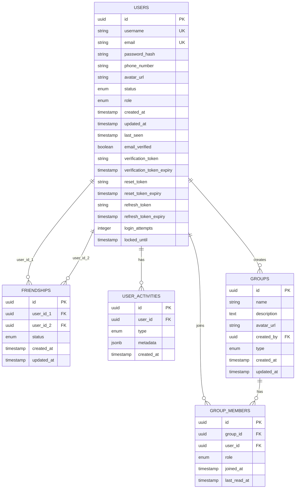

# Database Schema Design - Zola Platform

## Overview

This document outlines the complete database schema for the Zola Platform, a messaging and social networking application. The application uses a hybrid database architecture:

- **PostgreSQL 17.4+**: For relational, structured data (users, groups, friendships, activities)
- **AWS DynamoDB**: For high-throughput, flexible schema data (messages, conversations)
- **Redis**: For caching frequently accessed data
- **AWS S3**: For object storage (avatars, message attachments, shared files, analytics)

**Current Schema Version**: v2 (Flyway migrations applied)

## Performance Optimization Strategy

The schema includes **30+ optimized indexes** for maximum query performance:

- **Partial Indexes**: Applied on nullable columns (tokens, locked_until) to save storage space and improve index efficiency
- **Composite Indexes**: For multi-column queries (user_id + status, user_id + type + created_at)
- **GIN Indexes**: For JSONB metadata queries and full-text search capabilities
- **Descending Indexes**: For time-based queries with DESC ordering (created_at DESC, last_seen DESC)

## PostgreSQL Tables

### 1. Users Table

**Purpose**: Stores user account information, authentication data, and security features.

**Entity**: `com.zola.domain.user.entity.User`

```sql
CREATE TABLE users (
    -- Core Identity
    id UUID PRIMARY KEY DEFAULT gen_random_uuid(),
    username VARCHAR(50) UNIQUE NOT NULL,
    email VARCHAR(100) UNIQUE NOT NULL,
    password_hash VARCHAR(255) NOT NULL,

    -- Profile Information
    phone_number VARCHAR(20),
    avatar_url VARCHAR(500),

    -- Status & Role
    status VARCHAR(20) DEFAULT 'OFFLINE',
    role VARCHAR(20) DEFAULT 'USER',

    -- Timestamps
    created_at TIMESTAMP DEFAULT CURRENT_TIMESTAMP,
    updated_at TIMESTAMP DEFAULT CURRENT_TIMESTAMP,
    last_seen TIMESTAMP,

    -- Authentication Enhancement Fields (Added in v1)
    email_verified BOOLEAN DEFAULT FALSE,
    verification_token VARCHAR(500),
    verification_token_expiry TIMESTAMP,
    reset_token VARCHAR(500),
    reset_token_expiry TIMESTAMP,
    refresh_token VARCHAR(500),
    refresh_token_expiry TIMESTAMP,
    login_attempts INTEGER DEFAULT 0,
    locked_until TIMESTAMP,

    -- Constraints
    CONSTRAINT chk_user_status CHECK (status IN ('ONLINE', 'OFFLINE', 'AWAY', 'DO_NOT_DISTURB')),
    CONSTRAINT chk_user_role CHECK (role IN ('USER', 'ADMIN'))
);
```

**Indexes** (11 total):

```sql
-- Basic Indexes
CREATE INDEX idx_users_username ON users(username);
CREATE INDEX idx_users_email ON users(email);
CREATE INDEX idx_users_status ON users(status);
CREATE INDEX idx_users_phone_number ON users(phone_number);
CREATE INDEX idx_users_created_at ON users(created_at DESC);
CREATE INDEX idx_users_last_seen ON users(last_seen DESC);

-- Authentication Indexes (Partial - only index non-NULL values)
CREATE INDEX idx_users_reset_token ON users(reset_token)
    WHERE reset_token IS NOT NULL;
CREATE INDEX idx_users_verification_token ON users(verification_token)
    WHERE verification_token IS NOT NULL;
CREATE INDEX idx_users_refresh_token ON users(refresh_token)
    WHERE refresh_token IS NOT NULL;
CREATE INDEX idx_users_locked_until ON users(locked_until)
    WHERE locked_until IS NOT NULL;
CREATE INDEX idx_users_email_verified ON users(email_verified);
```

**Authentication Fields Explained**:

- `email_verified`: Boolean flag indicating if user's email is confirmed
- `verification_token`: UUID token sent via email for verification (expires after 24 hours)
- `reset_token`: UUID token for password reset flow (expires after 1 hour)
- `refresh_token`: Long-lived token (30 days) for obtaining new access tokens
- `login_attempts`: Counter for failed login attempts (triggers account lockout after 5 attempts)
- `locked_until`: Timestamp when account lockout expires (15 minutes default)

**Sample Data**: V2 migration includes 20 sample users with diverse statuses and verified emails.

---

### 2. Friendships Table

**Purpose**: Manages friend connections and friendship requests between users.

**Entity**: `com.zola.domain.user.entity.Friendship`

```sql
CREATE TABLE friendships (
    id UUID PRIMARY KEY DEFAULT gen_random_uuid(),
    user_id_1 UUID NOT NULL,
    user_id_2 UUID NOT NULL,
    status VARCHAR(20) DEFAULT 'PENDING',
    created_at TIMESTAMP DEFAULT CURRENT_TIMESTAMP,
    updated_at TIMESTAMP DEFAULT CURRENT_TIMESTAMP,

    FOREIGN KEY (user_id_1) REFERENCES users(id) ON DELETE CASCADE,
    FOREIGN KEY (user_id_2) REFERENCES users(id) ON DELETE CASCADE,

    CONSTRAINT chk_friendship_status CHECK (status IN ('PENDING', 'ACCEPTED', 'BLOCKED')),
    CONSTRAINT chk_different_users CHECK (user_id_1 != user_id_2),
    CONSTRAINT unique_friendship UNIQUE (user_id_1, user_id_2)
);
```

**Indexes** (6 total):

```sql
-- Basic Indexes
CREATE INDEX idx_friendships_user1 ON friendships(user_id_1);
CREATE INDEX idx_friendships_user2 ON friendships(user_id_2);
CREATE INDEX idx_friendships_status ON friendships(status);
CREATE INDEX idx_friendships_created_at ON friendships(created_at DESC);

-- Composite Indexes (optimizes queries like "get all friends with status")
CREATE INDEX idx_friendships_user1_status ON friendships(user_id_1, status);
CREATE INDEX idx_friendships_user2_status ON friendships(user_id_2, status);
```

**Status Values**:

- `PENDING`: Friend request sent, awaiting acceptance
- `ACCEPTED`: Mutual friendship established
- `BLOCKED`: User has blocked another user

**Sample Data**: V2 migration includes 28 diverse friendships (accepted, pending, blocked).

---

### 3. User Activities Table

**Purpose**: Tracks user actions and events for analytics and activity feeds.

**Entity**: `com.zola.domain.user.entity.UserActivity`

```sql
CREATE TABLE user_activities (
    id UUID PRIMARY KEY DEFAULT gen_random_uuid(),
    user_id UUID NOT NULL,
    type VARCHAR(50) NOT NULL,
    metadata JSONB,
    created_at TIMESTAMP DEFAULT CURRENT_TIMESTAMP,

    FOREIGN KEY (user_id) REFERENCES users(id) ON DELETE CASCADE,

    CONSTRAINT chk_activity_type CHECK (type IN (
        'LOGIN', 'LOGOUT', 'MESSAGE_SENT', 'GROUP_CREATED', 'GROUP_JOINED'
    ))
);
```

**Indexes** (5 total):

```sql
-- Basic Indexes
CREATE INDEX idx_user_activities_user_id ON user_activities(user_id);
CREATE INDEX idx_user_activities_created_at ON user_activities(created_at DESC);
CREATE INDEX idx_user_activities_type ON user_activities(type);

-- Composite Index (optimizes filtered activity queries)
CREATE INDEX idx_user_activities_user_type ON user_activities(user_id, type, created_at DESC);

-- GIN Index for JSONB queries
CREATE INDEX idx_user_activities_metadata ON user_activities USING GIN(metadata);
```

**Metadata Examples**:

```json
// LOGIN activity
{"ip_address": "192.168.1.1", "user_agent": "Mozilla/5.0..."}

// MESSAGE_SENT activity
{"recipient_id": "uuid", "message_type": "text"}

// GROUP_CREATED activity
{"group_id": "uuid", "group_name": "Study Group"}
```

**Sample Data**: V2 migration includes 20 activities across different users.

---

### 4. Groups Table

**Purpose**: Stores chat group information and metadata.

**Entity**: `com.zola.domain.group.entity.Group`

```sql
CREATE TABLE groups (
    id UUID PRIMARY KEY DEFAULT gen_random_uuid(),
    name VARCHAR(100) NOT NULL,
    description TEXT,
    avatar_url VARCHAR(500),
    created_by UUID NOT NULL,
    type VARCHAR(20) DEFAULT 'PRIVATE',
    created_at TIMESTAMP DEFAULT CURRENT_TIMESTAMP,
    updated_at TIMESTAMP DEFAULT CURRENT_TIMESTAMP,

    FOREIGN KEY (created_by) REFERENCES users(id) ON DELETE CASCADE,

    CONSTRAINT chk_group_type CHECK (type IN ('PRIVATE', 'PUBLIC'))
);
```

**Indexes** (6 total):

```sql
-- Basic Indexes
CREATE INDEX idx_groups_created_by ON groups(created_by);
CREATE INDEX idx_groups_type ON groups(type);
CREATE INDEX idx_groups_name ON groups(name);
CREATE INDEX idx_groups_created_at ON groups(created_at DESC);

-- Full-Text Search Indexes (using PostgreSQL's tsvector)
CREATE INDEX idx_groups_name_text ON groups
    USING GIN(to_tsvector('english', name));
CREATE INDEX idx_groups_description_text ON groups
    USING GIN(to_tsvector('english', COALESCE(description, '')));
```

**Type Values**:

- `PRIVATE`: Only invited members can join
- `PUBLIC`: Anyone can discover and join

**Sample Data**: V2 migration includes 10 diverse groups with themed names and descriptions.

---

### 5. Group Members Table

**Purpose**: Manages group membership and member roles.

**Entity**: `com.zola.domain.group.entity.GroupMember`

```sql
CREATE TABLE group_members (
    id UUID PRIMARY KEY DEFAULT gen_random_uuid(),
    group_id UUID NOT NULL,
    user_id UUID NOT NULL,
    role VARCHAR(20) DEFAULT 'MEMBER',
    joined_at TIMESTAMP DEFAULT CURRENT_TIMESTAMP,
    last_read_at TIMESTAMP,

    FOREIGN KEY (group_id) REFERENCES groups(id) ON DELETE CASCADE,
    FOREIGN KEY (user_id) REFERENCES users(id) ON DELETE CASCADE,

    CONSTRAINT unique_group_member UNIQUE(group_id, user_id),
    CONSTRAINT chk_member_role CHECK (role IN ('OWNER', 'ADMIN', 'MEMBER'))
);
```

**Indexes** (7 total):

```sql
-- Basic Indexes
CREATE INDEX idx_group_members_group_id ON group_members(group_id);
CREATE INDEX idx_group_members_user_id ON group_members(user_id);
CREATE INDEX idx_group_members_role ON group_members(role);
CREATE INDEX idx_group_members_joined_at ON group_members(joined_at DESC);
CREATE INDEX idx_group_members_last_read_at ON group_members(last_read_at DESC);

-- Composite Indexes
CREATE INDEX idx_group_members_group_role ON group_members(group_id, role);
CREATE INDEX idx_group_members_user_joined ON group_members(user_id, joined_at DESC);
```

**Role Values**:

- `OWNER`: Group creator, full permissions
- `ADMIN`: Can manage members and settings
- `MEMBER`: Standard member permissions

**Sample Data**: V2 migration includes 65 group memberships across 10 groups.

---

## AWS DynamoDB Tables

### Messages Table

**Purpose**: Stores all chat messages for high-throughput read/write operations.

**Structure**:

```json
{
  "messageId": "UUID (Partition Key)",
  "conversationId": "UUID (GSI Partition Key)",
  "senderId": "UUID",
  "recipientId": "UUID (for direct messages)",
  "groupId": "UUID (for group messages)",
  "content": "String",
  "type": "TEXT | IMAGE | VIDEO | FILE | AUDIO",
  "attachmentUrl": "String (S3 URL)",
  "timestamp": "Number (Sort Key for GSI)",
  "readBy": ["UUID array"],
  "deliveredTo": ["UUID array"],
  "status": "SENT | DELIVERED | READ | DELETED",
  "metadata": {
    "replyTo": "messageId",
    "edited": boolean,
    "editedAt": timestamp
  }
}
```

**Global Secondary Indexes**:

- `conversationId-timestamp-index`: For retrieving conversation history
- `senderId-timestamp-index`: For user's sent messages
- `recipientId-timestamp-index`: For user's received messages

---

### Conversations Table

**Purpose**: Tracks active conversations and their metadata.

**Structure**:

```json
{
  "conversationId": "UUID (Partition Key)",
  "type": "DIRECT | GROUP",
  "participantIds": ["UUID array"],
  "groupId": "UUID (if type=GROUP)",
  "lastMessageId": "UUID",
  "lastMessageAt": "Number (Sort Key)",
  "unreadCount": {
    "userId": number
  },
  "createdAt": "Number",
  "metadata": {
    "pinnedBy": ["UUID array"],
    "mutedBy": ["UUID array"]
  }
}
```

**Global Secondary Indexes**:

- `participantId-lastMessageAt-index`: For user's conversation list

---

## AWS S3 Buckets

### 1. zola-user-avatars

- Stores user profile pictures
- Public read access
- Size limit: 5MB per file
- Formats: JPEG, PNG, WebP

### 2. zola-message-attachments

- Stores message attachments (images, videos, files)
- Private access (pre-signed URLs)
- Size limit: 100MB per file

### 3. zola-shared-files

- Stores files shared in groups
- Private access (pre-signed URLs)
- Size limit: 500MB per file

### 4. zola-analytics-data

- Stores exported analytics and reports
- Admin-only access
- Retention: 90 days

---

## Entity Relationship Diagram



---

## Migration History

### V1\_\_init_database.sql (Initial Schema)

- Created all 5 PostgreSQL tables
- Added authentication enhancement fields to Users table
- Created 30+ optimized indexes (partial, composite, GIN, full-text)
- Applied constraints and foreign keys
- **Total Objects**: 5 tables, 30+ indexes, 12 constraints

### V2\_\_sample_data.sql (Sample Data)

- Inserted 20 diverse users (7 online, 3 away, 2 DND, 8 offline)
- Created 28 friendships (accepted, pending, blocked)
- Established 10 themed groups
- Added 65 group memberships
- Logged 20 user activities
- **All users have email_verified=TRUE for testing**

---

## Query Optimization Guidelines

### 1. Use Composite Indexes for Multi-Column Filters

```sql
-- Optimized: Uses idx_friendships_user1_status
SELECT * FROM friendships
WHERE user_id_1 = ? AND status = 'ACCEPTED';

-- Not optimized: Separate indexes for user_id_1 and status
```

### 2. Leverage Partial Indexes for Nullable Columns

```sql
-- Optimized: Uses idx_users_reset_token (partial index)
SELECT * FROM users WHERE reset_token = ?;

-- Index only stores rows where reset_token IS NOT NULL
```

### 3. Use GIN Indexes for JSONB Queries

```sql
-- Optimized: Uses idx_user_activities_metadata (GIN index)
SELECT * FROM user_activities
WHERE metadata @> '{"ip_address": "192.168.1.1"}';
```

### 4. Full-Text Search with tsvector

```sql
-- Optimized: Uses idx_groups_name_text (GIN index)
SELECT * FROM groups
WHERE to_tsvector('english', name) @@ to_tsquery('english', 'study');
```

---

## Security Considerations

### Password Storage

- BCrypt hashing with strength 10
- Stored in `password_hash` column
- Never exposed in API responses

### Token Security

- JWT access tokens: 15 minutes expiration
- Refresh tokens: 30 days expiration, stored in database
- Verification tokens: 24 hours expiration
- Reset tokens: 1 hour expiration
- All tokens use UUID v4 format

### Account Protection

- Account lockout after 5 failed login attempts
- 15-minute lockout duration (configurable)
- Email verification required for sensitive operations
- Refresh tokens invalidated on password change

### Data Privacy

- User passwords never logged or exposed
- Tokens use partial indexes to minimize storage
- Cascade deletes ensure data consistency
- Foreign key constraints enforce referential integrity

---

## Schema Maintenance

### Adding New Columns

1. Create new Flyway migration: `V3__description.sql`
2. Use `ALTER TABLE ADD COLUMN` with default values
3. Add corresponding indexes if needed
4. Update entity classes and DTOs

### Index Monitoring

```sql
-- Check index usage
SELECT schemaname, tablename, indexname, idx_scan
FROM pg_stat_user_indexes
ORDER BY idx_scan;

-- Find unused indexes
SELECT schemaname, tablename, indexname
FROM pg_stat_user_indexes
WHERE idx_scan = 0;
```

### Performance Analysis

```sql
-- Table sizes
SELECT tablename, pg_size_pretty(pg_total_relation_size(tablename::regclass))
FROM pg_tables
WHERE schemaname = 'public';

-- Index sizes
SELECT indexname, pg_size_pretty(pg_relation_size(indexname::regclass))
FROM pg_indexes
WHERE schemaname = 'public';
```

---

## Technology Requirements

- **PostgreSQL**: Version 17.4+ (for UUID, JSONB, GIN indexes, full-text search)
- **Java**: Version 17 or 21 (Spring Boot 3.4.1)
- **Spring Data JPA**: For ORM and repository layer
- **Flyway**: For database migrations
- **AWS SDK**: For DynamoDB and S3 integration
- **Redis**: For caching layer

---

## Related Documentation

- [API Design](./api-design.md) - REST API endpoints and request/response formats
- [Class Diagram](./class-diagram.md) - Entity classes and relationships
- [Authentication API](../AUTHENTICATION_API.md) - Detailed authentication endpoints
- [Microservices Migration Plan](../architecture/MICROSERVICES_MIGRATION_PLAN.md) - Future architecture plans

---

_Last Updated: January 2025_
_Schema Version: v2_
_Migration Tool: Flyway_
